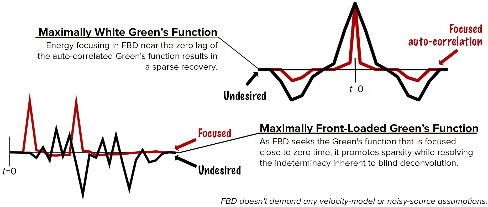
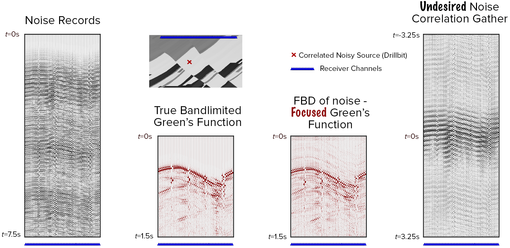
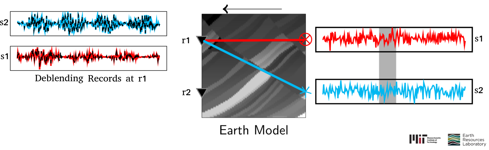
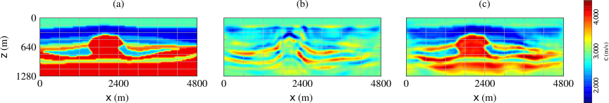
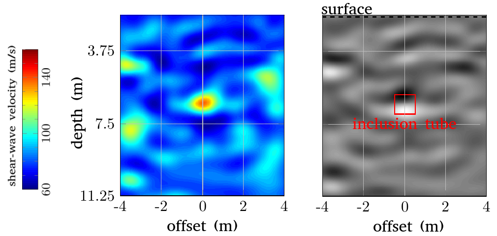


### Focused Blind Deconvolution (FBD) 

* FBD is a deconvolution algorithm that 
extracts sparse and front-loaded impulse responses from the channel outputs, i.e., 
their convolutions with a single arbitrary source. [\[paper\]](https://arxiv.org/abs/1808.00166)
[\[slides\]](https://github.com/pawbz/pawbz.github.io/blob/src/pdf/slides/Pawan_FBD_slides_SEGAM.pdf) 
* This method resolves the indeterminacy inherent to multichannel 
blind deconvolution and this project demonstrates 
its applications in both exploration and global seismology.
* In the seismic context, FBD not only 
outputs the 
subsurface Green's function, which can be directly input to imaging, 
but also helps us understand the source characteristics.

<figure>

</figure>

<i>Info-graphic of focused blind deconvolution, which is a data-driven Green's function retrieval algorithm for multi-channel seismic data of a noisy source.</i>

<figure>

</figure>

<i>Marmousi experiment, where FBD (data panel 3) outperforms the conventional Green's function retrieval from noise (data panel 1) through cross-correlation (data panel 4). When compared to the true Green's function (data panel 2), note that FBD not only recovers the direct arrival but also the scattered arrivals due to the reflectors in the medium.</i>

### Blind Source Separation/ Deblending
* This project demonstrates the application of 
frequency-domain independent component analysis
to deblend random seismic sources. 
[\[slides\]](https://github.com/pawbz/pawbz.github.io/blob/src/pdf/slides/Pawan_Seismic_ICA_Tue_Talk.pdf) 
[\[paper\]](https://library.seg.org/doi/abs/10.1190/segam2017-17677817.1)
* ICA uses higher-order statistics to measure the _Gaussianity_ of 
signals and working with convolutive mixtures 
(as in seismic exploration) is a challenging problem.

<figure>

</figure>

<i>The receivers (r1 and r2) record the blended wavefield due to simultaneous random 
sources (red s1 and blue s2). ICA decomposes the wavefield into isolated records 
involving one source at a time. The deblended records at the first receiver 
are shown.</i>

### Cycle Skipping in Full Waveform Inversion (FWI)
"When the seismic waveforms are too complicated to be analyzed during inversion, a simplification of them into envelope-like bumpy waveforms can be useful."

* A bump functional computes the data misfit in the inversion
after simplification. 
[\[slides\]](https://github.com/pawbz/pawbz.github.io/blob/src/pdf/slides/Pawan_BumpFunctional_Slides.pdf) [\[paper\]](https://academic.oup.com/gji/article/206/2/1076/2605991)
* It can be used as an auxiliary 
functional in FWI 
to overcome the well-known cycle-skipping problem. 
* Seismic inversion by maximizing the correlation between the observed and modelled seismic data. [\[slides\]](https://github.com/pawbz/pawbz.github.io/blob/src/pdf/slides/Pawan_SEG13slides.pdf)

<figure>

</figure>

<i>Subsurface P-wave velocity models. a) True. b) FWI result using 
the least-squares objective — convergence to local minima. c) 
Multi-objective FWI with the auxiliary bump functional.</i>

### Multi-parameter Seismic Inversion

An analysis of the multi-parameter inverse problem in quantitative seismic imaging.
[\[slides\]](https://github.com/pawbz/pawbz.github.io/blob/src/pdf/slides/Pawan_EAGE14slides.pdf) 
[\[paper\]](https://arxiv.org/abs/1804.01184)

### Near-surface Shear-wave Imaging

The Earth’s properties, composition and structure ahead of a tunnel boring machine (TBM) should be mapped for hazard assessment during excavation. For mapping, a seismic system is deployed on the machine’s cutter head, with a few sources and sufficiently many sensors.

* This project studies the feasibility of using 2-D SH full waveform inversion to this near-surface imaging problem, where the 
images need to be available in near real time and without human interaction.
* The focus was on a system for soft soils, where shear waves are better and easier 
to interpret than compressional waves.
* The study uses data acquired in a 
number of field settings by a shear-wave vibrator source that mimic realistic TBM configurations.

<figure>

</figure>

<i>Imaging a near-surface inclusion in the Netherlands. The actual location of a buried concrete 
tube is marked in red.
Shear-wave velocity (left) and impedance (right) estimates of 2-D SH 
full waveform inversion depict the inclusion.</i>

### Seismic Interferometry

* My research in this direction 
introduces super-virtual interferometry, a method to enhance  
the signal-to-noise ratio (SNR) of certain seismic phases (for example: head-wave refractions and diffractions),
which follow a common subsurface ray path before being 
recorded at receivers.
[\[paper\]](https://academic.oup.com/gji/article/188/1/263/633573)

* This method can not only enhance the SNR of the far-offset refracted seismic energy but also can detect the presence of diving waves in the first arrivals.
[\[paper\]]()

* This research also demonstrates the application of this methodology to enhance the core-diffracted arrivals in the earthquake records. 
[\[slides\]](https://github.com/pawbz/pawbz.github.io/blob/src/pdf/slides/Pawan_svi_cmb_compressed.pdf)

